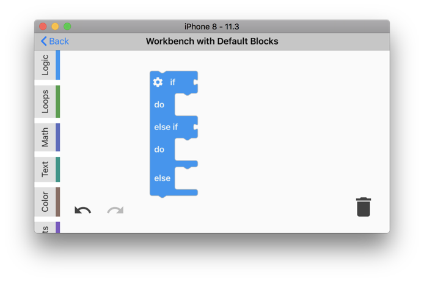
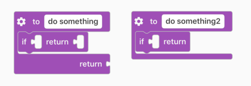
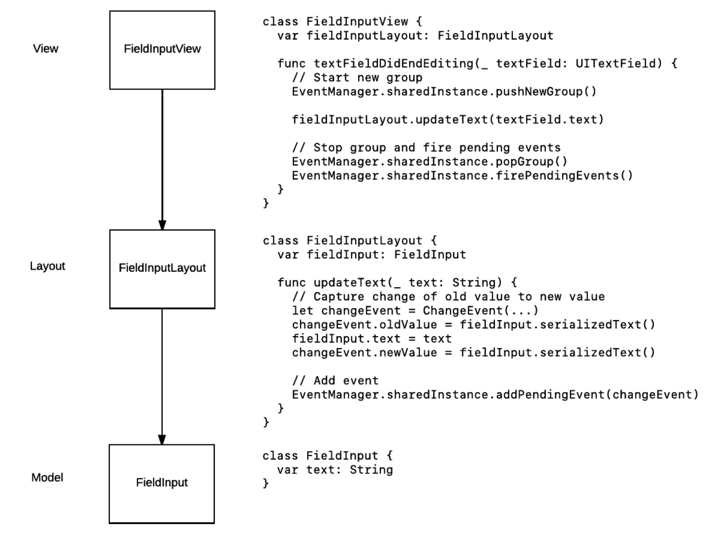

# **Blockly iOS Events**

Author: @vicng (March 2017)

# **Objective**

To enable undo/redo functionality in [Blockly iOS](https://developers.google.com/blockly/guides/get-started/ios) by adding "event" support. This functionality should be capable of rewinding and replaying both built-in library events (ie. create/delete/change/move/mutate events) along with custom developer-created events.

This design doc also provides guidance on how events should be fired, collected, and handled using this framework. This should make it easier to reason about event logic in library/developer implementations and lead to higher quality, less error prone code.


# **Background**

Events in Blockly are triggered when making changes to the workspace. Some examples of actions that trigger events are creating a block ("create"), deleting a block ("delete"), moving or connecting a block ("move"), or changing a field ("change").

In single user environments (ie. local environments), events are used to implement "undo" and "redo" functionality. As events are fired by the library, they are collected and logically grouped together so that they can be reversed (or replayed) when performing an undo (or redo) action.

In multi-user environments (ie. collaborative workspaces), events would be used to simultaneously coordinate actions between different users on the same workspace. Events generated by one user would be replayed in real-time for other users (similar to "redo"). While the event framework shouldn't preclude this type of feature, the Blockly team does not intend to implement collaboration at this time.


# **Other Considerations**

Events have already been implemented in [Blockly Web](https://developers.google.com/blockly/guides/configure/web/events) and the iOS implementation should maintain compatibility with its web counterpart. This means that iOS should generate the same serializable events for the same actions on both platforms. Ultimately, this will allow for cross-platform real-time collaboration.

That said, Blockly Web has had many issues with its event implementation, which has led to spaghetti code and band-aid fixes. The issues can be summarized as follows:

*   **Accidental event firing**: This is where an event is fired when it should not have been. A common example of this is where a method modifies a property of the object but also automatically generates an event for that change. There are times when this event shouldn't actually fire. (eg. [#960](https://github.com/google/blockly/issues/960) outlines a scenario where a shadow block inadvertently generates a delete event causing a bug with the undo stack.)
*   **Poor control over event firing:** It is difficult to control when events are fired. Sometimes objects need to be modified temporarily, where events should only be fired at the end of all temporary edits. (eg.[ #890](https://github.com/google/blockly/issues/890) describes the case where editing a text field fires change events for each character change, when the developer only wants a change event at the end).
*   **Buggy event chaining:** There have been many bugs related to code that generates more events in response to listening for certain events that have been fired. Common examples of this type of code are in mutators, variables, and procedures, where extra validation logic is performed in response to user edits. We've typically run into problems where the library gets into an invalid state when trying to rewind/replay all events (original + chained) in a single undo/redo action (eg. [#1391](https://github.com/google/blockly/issues/1391), [#541](https://github.com/google/blockly/issues/541)).
*   **Inconsistent event ordering:** Events are not always added in the sequential order they were created. (eg. In [#1036](https://github.com/google/blockly/issues/1036), mutation events are ordered ahead of all events in the group, even though there's no reason for this to occur. It seems it was done this way as a hack to fix event chaining related to variables/procedures, but it's caused other bugs as a result.)
*   **Messy event grouping:** There is a lot of extra code where event groups are set around every fired event. This is unnecessary and has bloated the codebase needlessly. It has also created an edge case bug where an event can prematurely cut off the event group from a higher event group surrounding that code. 

The iOS implementation aims to fix these problems and also support the following:

*   **Custom events:** Allow developers to create their own events which can be rewound/replayed just like built-in library events.
*   **Simplicity:** The event code needs to be robust enough to handle all the use-cases, but also simple enough so that events can be reasoned about throughout the app. Redoing/undoing an event group is tricky and could lead to out-of-order problems, events being replayed too often, or infinite event chaining.

# **Design Highlights**

Originally, the thought was to design an API that simply fixes all of the aforementioned problems, by introducing rigid rules/error checking into the event framework. However, the problem with this type of approach is that it can be very inflexible. Developers will invariably find edge-cases that don't fit our rules, which will lead to either more rules or strange band-aid fixes. As an open-source library, this leads us down a bad road and potentially puts us in a bad position in the future.

Therefore, the idea is to split the design into two parts:

1.  **API**: These are the actual objects/methods of the event framework.
1.  **Best practices guide**: This is _how_ users should call the event framework.

The event framework API is purposely designed to be relatively sparse. This allows it to be performant, robust, and highly flexible. It can be called from anywhere in code, and does not provide much error checking nor rigid rules on how it should be called. It is in designed in conjunction with a best practices guide, which developers should follow in order to properly understand how to use the event framework.

This approach should help developers reason about the event framework. It shouldn't be unfamiliar territory for iOS developers since it follows similar iOS API paradigms, where the API is relatively flexible, but needs to be used in a certain way (eg. autorelease pools, view controllers).

# **API**

## BlocklyEvent

This is the base class for any event in Blockly iOS.


```
public class BlocklyEvent {
  /// The type of this event
  public let type: String
  /// The ID for the workspace that triggered this event.
  public let workspaceID: String
  /// The ID for the group of related events.
  public var groupID: String?
  /// The ID of the primary or root affected block.
  public let blockID: String?
}
```


All custom events, such as `CreateEvent` or `MoveEvent`, are subclasses of `BlocklyEvent`.


## EventManager

This is the object responsible for managing events in Blockly iOS:


```
public class EventManager {
  // Shared instance.
  public static var sharedInstance = EventManager()

  // MARK: - Event Firing

  // Queue an event to be fired
  public func addPendingEvent(_ event: BlocklyEvent)

  // Fire all pending events
  public func firePendingEvents()

  // MARK: - Event Grouping

  // Each new event that is queued is automatically assigned this
  // group ID, if it's missing a group ID. This is the top-most group
  // ID that has been pushed onto the "group stack".
  public private(set) var currentGroupID: String?

  // Create a group UUID and push it onto the group stack.
  // `self.currentGroupID` becomes assigned to this new group UUID.
  public func pushNewGroup()

  // Push a given group ID onto the group stack.
  // `self.currentGroupID` becomes assigned to this new group ID.
  public func pushGroup(groupID: String)

  // Pop the current group ID off the group stack.
  // `self.currentGroupID` becomes assigned to the previous group ID that 
  // was pushed onto the group stack, or `nil` if the stack is empty.
  public func popGroup()

  // MARK: - Listeners

  // Add listener for event fires
  public func addListener(_ listener: EventManagerListener)

  // Remove listener from event fires
  public func removeListener(_ listener: EventManagerListener)
}

public protocol EventManagerListener {
  // Triggered whenever an event is fired from an `EventManager`
  func eventManager(_ eventManager: EventManager,
                didFireEvent event: BlocklyEvent)
}
```


EventManager is a singleton that is accessed via `EventManager.sharedInstance`. It's responsible for three major functions:


*   Adding pending events
*   Grouping events
*   Firing queued events

By designing EventManager as a singleton, it allows any piece of code to call the event framework, giving maximum amount of flexibility for developers.


### Adding Pending Events

Any new events generated by the library should be added by calling the following code:


```
// Create a new event.
let event = ChangeEvent(...)
// Add the event.
EventManager.sharedInstance.addPendingEvent(event)
```


These events sit in a queue, waiting to be fired.


### Grouping Events

Event groups are used to gather events that should be rolled back together in a single undo or redo action. An example of an action requiring an event group is renaming a variable -- every block using that variable name will generate a change event from the old name to the new name.

In order to group an event, a value needs to be assigned to its `groupID` property (by default, it is `nil`). However, we don't recommend users do this manually since it's easier to do through the `EventManager`.

The `EventManager` has the concept of a "group stack". A group ID can be pushed onto the group stack, whereby the top-most value on the stack is then assigned as the `groupID` for any new added events (whose `groupID` is `nil`). This group ID then can be popped off the stack and the next top-most value on the stack becomes the `groupID` assignee for future events (or `nil` if the stack is now empty). 

Here's an example of how it works:


```
let eventManager = EventManager.sharedInstance

// Push a new group, generated with a random UUID.
// `eventManager.currentGroupID` is now equal to this new ID.
eventManager.pushNewGroup()

// Create a new event.
// `event.groupID` is `nil` to begin with.
let event = ChangeEvent(...)

// Add the event.
// `event.groupID` is now equal to `eventManager.currentGroupID`.
eventManager.addPendingEvent(event)

// Pop the current group.
// `eventManager.currentGroupID` is now `nil`
eventManager.popGroup()
```


### Firing Events

"Firing an event" means cycling through every listener of `EventManager` and calling:


```
listener.eventManager(self, didFireEvent: event)
```


`firePendingEvents()` fires all events previously queued up via `addPendingEvent()`. Once it has finished executing, the event queue is empty.


## Undo/Redo Stack




`WorkbenchViewController` listens to `EventManager` in order to implement undo and redo operations. Events fired from `EventManager` are collected by the workbench and placed into an undo stack.

Every time the user performs an undo, the workbench pops off the top-most group of events that have been pushed onto the undo stack (or just a single event if the top-most event has no group). For each event in that group, the workbench performs an operation to effectively undo it. Once all events have been processed, the previous action has been "undone". These grouped events are then added onto the redo stack so they can be re-applied in the same manner.


```
NOTE: When an undo/redo action is performed, EventManager will generate events again for replayed operations. WorkbenchViewController does not record these re-generated events (or else it will duplicate events it knows about), but it does not stop other listeners of EventManager from receiving these replayed events.
```


## Chaining Events

Sometimes additional events need to be chained to a group of events that were previously fired.

For example, every time a block has been connected or disconnected in the workspace, each "if/return" block needs to change the existence of its "return" input based on whether it's now inside a procedure definition block with a return value (or not).



If an "if/return" block needs to be mutated, we want to group events for this mutation with the same group that fired the connect/disconnect event, so one single undo action will both undo the "if/return" mutation and the original connect/disconnect event.

The logic to accomplish this comes in two parts:


1.  Listen for a specific event to fire from `EventManager` 
1.  All additional changes made by the listener should be wrapped in a new group using the same group ID as the fired event. At the end of the grouping, all pending events should be fired since we can't rely on there being user interaction after this point (which is the only other trigger for firing pending events).

Here's some code for how this looks in practice:


```
public func eventManager(_ eventManager: EventManager,
                     didFireEvent event: BlocklyEvent) {
  if isRelevantEvent(event) {
    EventManager.sharedInstance.pushGroup(groupID: event.groupID)
    
    // Make additional changes
    ...

    EventManager.sharedInstance.popGroup()
    EventManager.sharedInstance.firePendingEvents()
  }
} 
```


## **Best Practices for Using Event Framework**

In order to maintain consistency and to make it easier to reason about events, different type of event code should only be called in specific areas of code. Specifically, Blockly iOS is already split into four layers: [Model, Layout, View, and Controller](http://go/blockly-ios-architecture-dd). Each layer should be responsible for calling some part (or no part) of `EventManager`:


### Model

Best practice: **No event handling code here.**

The model layer is considered "dumb" and is constantly being put into temporary states. Due to its transient state, we don't recommend creating events in the model code, nor making any calls to `EventManager` from here.


> **Reasoning**: This solves the problem of accidental event firing, where developers know they can safely modify this layer without firing events.


### Layout

Best practice: **Add pending events here. Don't group or fire events here, except during Event Chaining.**

The layout layer is considered the "business" layer of Blockly iOS and is what manages access to the Model layer. It is the appropriate place for creating and adding events to `EventManager` since high-level logic is done at this layer (eg. adding a block, deleting a block, changing field data, etc.). Generally speaking, it is **not** the place to group and fire events though since it is difficult to determine what actions should be logically grouped together. The only exception to when it's ok to group and fire events is during Event Chaining.


> **Reasoning**: This separation lets developers know when to call Layout code (which will generate events) or Model code (which won't generate events). Additionally, they do not need to worry about event grouping or firing at this level (except during Event Chaining), which makes the actual event code very simple (ie. generate event and add it to queue).


### View and Controller

Best practice: **Group and fire events here. Only UI events should be added in this layer.**

These two layers are where views are rendered to screen and where the user interacts with views. Because these layers can track when users finish complete "actions" (like dragging a block, complete editing of a text field), this is where groups should be started/stopped, and where pending events should be fired off (they should only be fired once there's enough information to build a proper undo/redo action).


> **Reasoning**: With this separation, it allows developers to easily tie event grouping and firing to user actions.


### Example

Here is an example of how event code looks like for a FieldInput.




## Nested Different Groups

While it's technically possible to nest different groups of events, it should be avoided as it can cause problems when undoing/redoing events. In debug mode, the library will assert that a new group shouldn't be pushed if an existing group of a different ID is already on the stack. In release mode, this will generate a warning.

This scenario should be easy to avoid as long as new groups are only created for every set of new touches.

Here are some examples of how to implement grouping:

1) During multi-touch drags:


*   Push group: On the first block touch.
*   Pop group: After there are no more blocks being touched.
*   Fire events: Every time a touch has been let go.

2) Editing a field input:


*   Push group: Immediately before committing the change (ie. pressing the enter key)
*   Pop group: Immediately after committing the change.
*   Fire events: Immediately after popping the group.