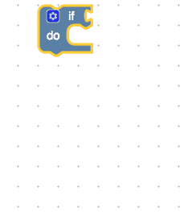
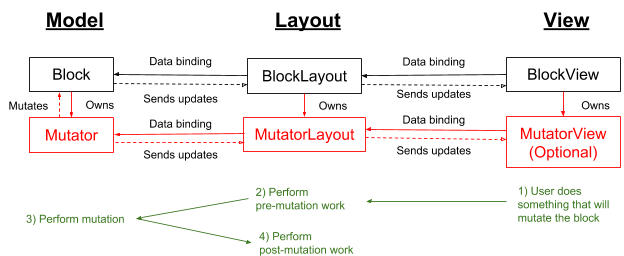
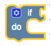
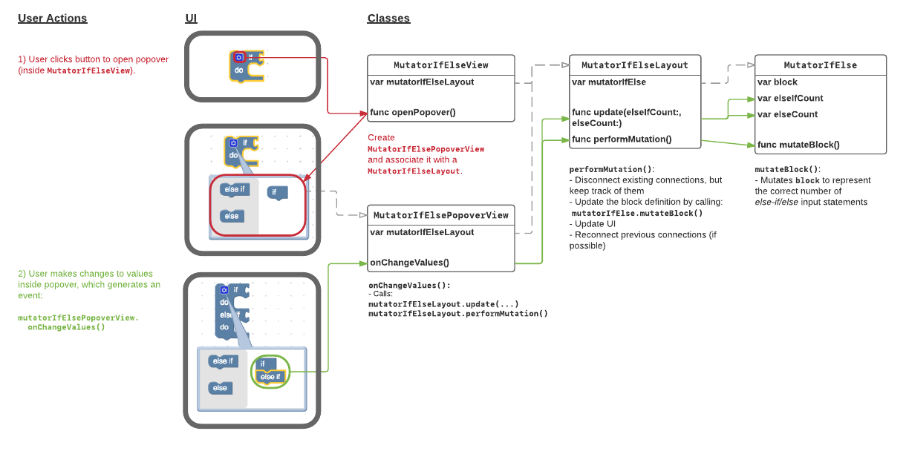

# **Blockly iOS Mutators Design Doc**

Author: @vicng (Dec 2016)


# **Objective**

To add "block mutator" support in [Blockly iOS](https://developers.google.com/blockly/guides/get-started/ios), so that blocks can be changed dynamically by the user (eg. via a popover view).


# **Background**

Block mutators already exist in [Blockly Web](https://developers.google.com/blockly/guides/create-custom-blocks/mutators) and the iOS implementation must be compatible with the Web version. This requires that:

*   Mutable blocks must use the same XML data format when importing/exporting mutable blocks in a workspace
*   It should be possible to implement equivalent solutions for all different types of block mutators currently in the Web version. These include:
    *   **If/else block**: An _if_ block, where it can be configured to include _else if_ and _else_ statements.
    *   **Functions**: A block for defining "functions" within the workspace, where it can be configured to have optional "parameters" and/or a "return value".
    *   **List blocks**: A block for creating "arrays" of a configurable item length.
    *   **Dynamic drop-down blocks**: A block where the existence of certain fields/inputs change based on the value of a drop-down field.

Here's an example of an _if/else_ mutator block in Blockly Web:




# **Other Considerations**

While the [JSON format](https://developers.google.com/blockly/guides/create-custom-blocks/define-blocks) is good for defining immutable blocks for cross-platform development, it isn't worthwhile to extend the format to support block mutations. The reasons for this are:

*   Block mutations should be flexible in their possibilities and a JSON format would impose restrictions on what developers could do
*   Implementing a cross-platform language to define mutation business logic would be a complex task
*   The UX for presenting a mutation would most likely devolve into a lowest common denominator solution across all 3 platforms

Ultimately, this means that developers will need to implement platform-specific code if they want to support block mutations on multiple platforms. Our design will try to minimize the amount of work needed to do this (eg. minimize the number of implementation end-points, provide re-usable UI components for mutator popover controllers).


# **Design Highlights**

Block mutations can be broken down into the following steps:

1.  The user attempts to mutate a block (eg. by changing settings in a block's popover window)
1.  Perform any pre-mutation work (eg. keep track of existing connections on that block, keep track of other blocks depending on that block)
1.  Mutate the block definition
1.  Perform any post-mutation work (eg. update the UI, re-connect existing block connections, update blocks that were depending on the mutated block)


## Class Hierarchy

In order to implement mutators, 3 new object types need to be added to the architecture:

*   `MutatorView` (responsible for Step #1)
*   `MutatorLayout` (responsible for Step #2 and #4)
*   `Mutator `(responsible for Step #3)

Here's how they fit in the class hierarchy and how they relate to the steps above:



_**Note**: An example of how an if/else mutator might be implemented under this class hierarchy is detailed
later in this document._


### Mutator

This is what's needed for the `Mutator` interface:

```
public protocol Mutator {
  // The block that will be mutated
  weak var block: Block? { get set }

  // Mutates `self.block` based on this mutator's internal state.
  func mutateBlock()

  // Returns XML based on this mutator's internal state
  func toXMLElement() -> AEXMLElement

  // Updates this mutator's internal state from XML.
  // Note: This method call does not actually mutate the block.
  // mutateBlock() must be explicitly called after this.
  func update(fromXML xml: AEXMLElement)

  // Returns a copy of this mutator
  func copyMutator() -> Mutator
}
```

Concrete classes of `Mutator` are responsible for:

*   Performing the mutation on its associated `Block` object (not the block itself)
*   Importing/exporting xml related to its current mutation state
*   Copying itself


### MutatorLayout

In the layout tree hierarchy, `MutatorLayout` is a child of a `BlockLayout`. The concrete implementation of `BlockLayout` (eg. `DefaultBlockLayout`) is responsible for positioning the `MutatorLayout`.

Here is the abstract class definition of a `MutatorLayout`:

```
public class MutatorLayout {
  // The associated mutator
  public let mutator: Mutator

  // Performs any work required to maintain the integrity of the layout
  // hierarchy, in addition to calling `mutator.mutateBlock()`.
  // This is where pre-/post- mutation work would be handled.
  public func performMutation()
}
```

`MutatorLayout` is responsible for:

*   Indicating the size of its UI, for its parent `BlockLayout`. Note that this size could be (0, 0) if there is no UI associated with the layout.
*   Performing the mutation on the model while maintaining the layout hierarchy tree to match any mutation updates.
*   Any business logic that should be applied before and after the mutation. An example of this would be disconnecting existing blocks and then reconnecting them after the block has been mutated (where possible).

Here's example pseudocode for `performMutation()`:

```
public func performMutation() {
  // Perform pre-mutation work (eg. disconnect existing connections and
  // track them for later).

  // Call mutator.mutateBlock() to update the block definition.

  // Update the block layout hierarchy to reflect the updated mutation.

  // Perform post-mutation work (eg. re-connect previously tracked
  // connections, where possible).
}
```


### MutatorView

`MutatorView` is the associated view of a `MutatorLayout`, and is responsible for:

*   Rendering the mutator's UI (eg. a button that opens a popover window, with configurable settings)
*   Making calls to its `MutatorLayout` to perform the mutations

_**Note: `MutatorView`** is optional and does not necessarily need to be specified. Developers may choose to perform mutations on a block depending on other events in the system (eg. a dropdown on-change event), rather than implementing specific UI for it._

## Defining a Mutable Block

The convention that we recommend for developers is that a mutable Block continued to be specified using the JSON format. What's specified in JSON format should be how the Block would look in its "default" state. For example, the _if/else_ block's default state is to simply render an _if_ statement:



Then, a `Mutator` class (eg. `MutatorIfElse`) should be attached to the `Block` (or rather its `BlockBuilder` inside the `BlockFactory`). The mutator would be responsible for transforming the block out of its default state.

_**Note**: When a mutable `Block` is imported into a workspace via XML, the block's `BlockBuilder` object in the `BlockFactory` must have a `Mutator` associated with it already. If it isn't, the block will not be imported correctly._

Eg.

```
// Load if/else block definition into the block factory
blockFactory.load(fromJSONPaths:["if_block.json"])
// Set mutator for if/else block
blockFactory.blockBuilders["controls_if"].mutator = MutatorIfElse()
// Now it's safe to load any XML containing that block
try workspace.loadBlocks(fromXMLString: workspaceXML, factory: blockFactory)

```


# **Implementation Details**


## Changes to `Block`

Each `Block` can be optionally associated with a `Mutator`:


```
public Block {
  // An optional mutator associated with this block
  public let mutator: Mutator?

  public init(..., mutator: Mutator?) {
    self.mutator = mutator
    super.init()

    // Associate mutator with block
    self.mutator?.block = self
  }
}
```


The `Block` object needs to be updated so that its `inputs` are mutable (via helper methods). This means that care needs to be taken elsewhere in the library so that the layout hierarchy is updated whenever `inputs` are changed. 


## Changes to `BlockFactory`

`load(fromDefaultFiles:)` method should automatically set the mutators for ones we have already implemented.

For example, when loading the `.LogicDefault` file, we should automatically set `MutatorIfElse()` as the mutator for the "`controls_if`" block builder .


## Changes to `LayoutFactory/LayoutBuilder`

`LayoutFactory` and `LayoutBuilder` need to be made aware of mutators. This allows Blockly developers to customize mutators, either for their own custom mutators or for changing default behaviour.


## Example If/Else Mutator

Here's an example of how an _if/else_ mutator might be implemented (some details are omitted for brevity):




```
public class MutatorIfElse : Mutator {
  public weak var block: Block? = nil
  public var elseIfCount = 0
  public var elseCount = 0

  public func mutateBlock() {
    guard let block = self.block else {
      return
    }

    // Remove inputs from `self.block`.
    if let elseInput = block.firstInput(withName: "ELSE") {
      block.removeInput(elseInput)
    }
    var i = 1;
    while let ifInput = block.firstInput(withName: "IF\(i)"),
      let doInput = block.firstInput(withName: "DO\(i)")
    {
      block.removeInput(ifInput)
      block.removeInput(doInput)
      i++;
    }

    // Add the correct number of else-if/else inputs to `self.block`
    for i in 1 … elseIfCount {
      let ifBuilder = InputBuilder(type: .Value, name: "IF\(i)")
      ifBuilder.connectionTypeChecks = ["Boolean"]
      ifBuilder.appendField(FieldLabel(name: "ELSEIF", text: "else if"))
      block.appendInput(ifBuilder.makeInput())
      
      let doBuilder = InputBuilder(type: .Statement, name: "DO\(i)")
      doBuilder.appendField(FieldLabel(name: "DO", text: "do"))
      block.appendInput(doBuilder.makeInput())
    }

    if elseCount > 0 {
      let elseBuilder = InputBuilder(type: .Statement, name: "ELSE")
      elseBuilder.appendField(FieldLabel(name: "ELSE", text: "else"))
      block.appendInput(elseBuilder.makeInput())
    }
  }

  public func toXMLElement() -> AEXMLElement {
   return AEXMLElement(name: "mutation", value: nil, attributes: [
       "elseif": String(elseIfCount),
       "else": String(max(elseCount, 1))
     ])
  }

  public func update(fromXML xml: AEXMLElement) {
    let mutationXML = xml["mutation"]
    elseIfCount = Int(mutationXML.attributes["elseif"] ?? "") ?? 0
    elseCount = Int(mutationXML.attributes["else"] ?? "") ?? 0
  }

  public func copyMutator() -> Mutator {
    let mutator = MutatorIfElse()
    mutator.elseIfCount = elseIfCount
    mutator.elseCount = elseCount
    return mutator
  }
}
```


```
public class MutatorIfElseLayout : MutatorLayout {
  private let mutatorIfElse: MutatorIfElse
  public var workspaceLayoutCoordinator: WorkspaceLayoutCoordinator?

  public init(engine: LayoutEngine, mutator: MutatorIfElse) {
    self.mutatorIfElse = mutator
    super.init(engine: engine, mutator: mutator)
  }

  public override func performLayout(includeChildren: Bool) {
    // Inside a block, this mutator is only the size of a "settings" button
    self.contentSize = WorkspaceSize(width: 44, height: 44)
  }

  /** This would be called by MutatorElseIfView prior to calling
      performMutation() */
  public func update(elseIfCount: Int, elseCount: Int) {
    mutatorIfElse.elseIfCount = elseIfCount
    mutatorIfElse.elseCount = elseCount
  }

  /** This would be called by MutatorElseIfView to perform the mutation. */
  public override func performMutation() throws {
    guard let block = mutatorIfElse.block,
      let layoutCoordinator = workspaceLayoutCoordinator else {
      return
    }

    // Track current connections connected to else-if/else inputs
    var connections = ...

    // Update the definition of the block
    mutatorIfElse.mutateBlock()

    // Update UI
    layoutCoordinator.layoutBuilder.buildLayoutTree(
      forBlock: block, engine: self.engine)

    // Reconnect connections from mutatorIfElse
    MutatorHelper.reconnect(connections, …)
  }
}
```
